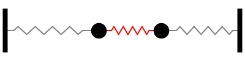

# So you want to animate your PDF files?

Here are some quick and dirty steps to include an animation in a pdf file.  
Note that not all pdf readers will support rendering the animation and many of them will show just a static image (likely the initial frame) or nothing at all. An open source app that does support this is KDE's [Okular](https://okular.kde.org/).

*   Let's assume this is your animation and it is stored in the address `images/masses_springs_animation.gif`. I got this one from [here](https://www.acs.psu.edu/drussell/Demos/multi-dof-springs/multi-dof-springs.html).  

    

*   First you need to convert all the frames of the gif file into png files. On a linux terminal you do something like this:

    convert -verbose -coalesce images/masses\_springs\_animation.gif images/masses\_springs\_frame.png

    This will create a whole bunch of png files named `masses_springs_frame-x.png` where x is the frame number starting from 0 and going up to the last frame count. For this gif file the last one is 239.
*   The rest of the magic is in the latex code. You need two style files [`animate.sty`](animate.sty) and [`animfp.sty`](animfp.sty), either install them in your latex setup or just copy and paste them in the same folder as your tex file.
*   Finally add the files into your tex file. You'll need some lines like this:
    ```
    ...
    \usepackage{animate}
    ...
    \begin{document}
        ...
        \animategraphics[scale=.4,autoplay,loop]{16}{images/masses_springs_frame-}{0}{239}
        ...
    \end{document}
    ```
    `scale=.4`: here I'm scaling the frames to 40% of their original size  
    `autoplay`: starts playing the animation as soon as the page is opened  
    `loop`: loops through the frames indefinitely  
    `16`: is the speed of the animation (frames per second I guess)  
    `masses_springs_frame-`is the common part of the names of the files for frames  
    and finally, `0` and `239` are start and end numbers in the files names that correspond to the first and last frames.
This should be enough to get you going. Here is a sample [tex](simple_animation.tex) file and the resulting [pdf](simple_animation.pdf) file. Read this on my [blog](https://github.com/k1monfared/terminal/tree/main/latex/animate_pdf).
